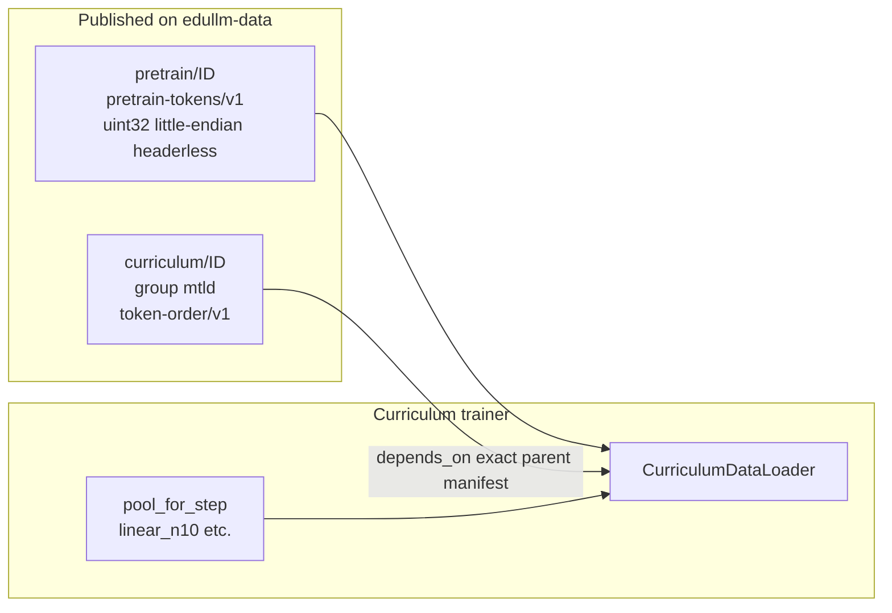

# MTLD Labeling and Curriculum Publishing Handoff

Handoff plan for labeling an eduLLM pretrain corpus with RegMix-compatible MTLD scores, building a parent-pool token-order permutation, and publishing both `pretrain/*` and `curriculum/*` datasets so they work unchanged with the curriculum training code in edu-llm/OLMo-core.

## Repositories

| Repo | Role |
|------|------|
| [edu-llm/edullm](https://github.com/edu-llm/edullm) | MTLD labeling, curriculum index build, dataset publish scripts |
| [edu-llm/OLMo-core](https://github.com/edu-llm/OLMo-core) | Curriculum training loader (`.edullm/` directory) |
| [edu-llm/edullm-data](https://github.com/edu-llm/edullm-data) | `publish()` API, validator contract, S3 layout |

Use the **edullm-dataset** and **edullm-dataset-design** skills for staging layout, `publish()` calls, and validator expectations — this plan does not duplicate that skill content.

---

## Goal

Produce two sealed eduLLM datasets that plug directly into the curriculum loader without modifying training code:

| Dataset | Profile | Purpose |
|---------|---------|---------|
| `pretrain/<your-id>` | `pretrain-tokens/v1` (+ optional `text-corpus/v1` companion) | Flat token pool for training |
| `curriculum/<your-id>` | `token-order/v1` group **`mtld`** | Easy→hard permutation over the parent pool |

**RegMix reference (published on `edullm-data`):**

- Parent: `pretrain/regmix-10b` v1 (manifest SHA `a24992f53dc4a900bacf8fa571d77e343fd28ffa9054c14b93d54204b0a38cb4`)
- Orders: `curriculum/regmix-370m` with groups `compression`, `flesch`, `mtld`, `learnability`
- For MTLD-only datasets, publish a single `mtld` group (same contract as the `mtld` group in RegMix; see [datasets/regmix/README.md](https://github.com/edu-llm/edullm/blob/main/datasets/regmix/README.md))

**What training code expects** (enforced in [`.edullm/curriculum_data.py`](https://github.com/edu-llm/OLMo-core/blob/main/.edullm/curriculum_data.py) and [`.edullm/curriculum_loader.py`](https://github.com/edu-llm/OLMo-core/blob/main/.edullm/curriculum_loader.py)):



- Parent tokens: `<u4` (little-endian uint32), `header_bytes=0`, sequence length **2048**
- Order vector: length = total flat parent chunks = sum over train shards of `(shard_tokens - 1) // 2048`
- Order must be a **complete permutation** of `[0, n_chunks)`
- Curriculum group `mtld` must declare `depends_on` the exact parent `dataset_id`, `version`, and `manifest_sha256`
- Arms `linear10-mtld` (index 1) and `quadratic10-mtld` (index 6) read `order_group: "mtld"` ([`.edullm/curriculum_recipe.json`](https://github.com/edu-llm/OLMo-core/blob/main/.edullm/curriculum_recipe.json))

After publish, pin the new parent manifest SHA and curriculum dataset id/version in [`.edullm/curriculum_recipe.json`](https://github.com/edu-llm/OLMo-core/blob/main/.edullm/curriculum_recipe.json) and the constants in [`.edullm/curriculum_entrypoint.py`](https://github.com/edu-llm/OLMo-core/blob/main/.edullm/curriculum_entrypoint.py) (`PARENT_*`, `ORDER_DATASET_ID`).

---

## Must the parent be published?

### For training

**Yes.** The loader only accepts inputs from **`s3://edullm-data/`** (validator-promoted). Every arm needs the sealed parent; MTLD arms also need the sealed `curriculum/*` order.

### For curriculum labeling / ranking

**No — parent publish is not required before MTLD labeling or before building the local order.** All of this can run on local staged data:

| Step | Needs published parent? | What it actually needs |
|------|------------------------|-------------------------|
| MTLD shard labeling (`label_olmo_shard.py`) | **No** | Local trimmed text shards (same docs that were tokenized) |
| Label finalization (`finalize_olmo_labels.py`) | **No** | Local `labels/` tree |
| Provenance enrichment (see Phase 2 step 3) | **No** | Local trim + local `tokenized/<domain>.json` / `.npy` metas |
| Build order (`build_curriculum_index.py` or MTLD-only equivalent) | **No** | Local enriched labels + **`parent_layout.json`** |
| Capture layout (`capture_regmix_parent_layout.py` or equivalent) | **No** | Local publish **stage dir** (`tokens/<source>/train-*.u32le.bin`) |

The ranking scripts do **not** call S3. RegMix documents this: step 1 is “build local ranked index (needs labels on disk)”; step 2 is “publish token-order groups (**requires** pretrain on edullm-data)” — [datasets/regmix/README.md](https://github.com/edu-llm/edullm/blob/main/datasets/regmix/README.md).

**Critical constraint:** `parent_layout.json` must describe the **exact** shard order, token counts, and `source_token_start` offsets of the parent that will eventually be published. Re-staging or re-tokenizing after building the order invalidates the permutation.

**Recommended workflow:**

```
trim/tokenize → stage parent layout locally
     → MTLD label + enrich (parallel with or before publish)
     → capture parent_layout.json from local stage dir
     → build ranked_chunks_mtld.npy locally
     → publish pretrain/* (validator promotes to edullm-data)
     → fill in / verify manifest_sha256 in curriculum_manifest.json
     → publish curriculum/*
```

The `manifest_sha256` is metadata for publish — not used in ranking math — but **must** match the promoted parent before `publish_regmix_curriculum_edullm_data.py` runs.

**`labels/` alone is never sufficient** for MTLD curriculum arms — trainers read `curriculum/<id>` group `mtld`, not heuristic labels.

---

## Prerequisites

- Tokenized parent corpus uses **dolma2** (`allenai/dolma2-tokenizer`, EOS `100257`) with the same packing rules as RegMix trim/tokenize
- Val carve: **0.15% per source** from each domain tail (so val mix weights match train mix)
- Train shards: `tokens/<source>/train-*.u32le.bin`, max 1 GiB per shard
- `edullm-data` installed: `pip install git+https://github.com/edu-llm/edullm-data@main`
- AWS credentials with publish access to `s3://edullm-landing/`

---

## Phase 1 — Publish the parent pretrain corpus

**Reference:** [datasets/regmix/publish_regmix_edullm_data.py](https://github.com/edu-llm/edullm/blob/main/datasets/regmix/publish_regmix_edullm_data.py)

**Required publish layout** (under local `--stage-dir` before `publish()`):

```
tokens/<source>/train-00000.u32le.bin
tokens/<source>/val-00000.u32le.bin
text/<source>/...          # optional companion group (text-corpus/v1)
```

**Profile map:** `tokens` → `pretrain-tokens/v1`; `text` → `text-corpus/v1` (if included).

**After promotion on `edullm-data`, record:** `dataset_id`, `version`, parent group `manifest_sha256` (64-char hex).

**Do not publish the curriculum order until the parent is validator-promoted.** The curriculum publisher cross-checks live parent layout ([`publish_regmix_curriculum_edullm_data.py`](https://github.com/edu-llm/edullm/blob/main/datasets/regmix/publish_regmix_curriculum_edullm_data.py)). Local `ranked_chunks_mtld.npy` can be built earlier from a frozen stage dir.

---

## Phase 2 — MTLD labeling (exact algorithm)

**Canonical implementation:** [datasets/olmo/text_difficulty_metrics.py](https://github.com/edu-llm/edullm/blob/main/datasets/olmo/text_difficulty_metrics.py)

### MTLD definition (must match exactly)

| Parameter | Value |
|-----------|-------|
| Algorithm | Bidirectional MTLD (McCarthy & Jarvis 2010) |
| TTR factor threshold | **0.72** |
| Tokenization | See code block below |
| Short docs (<10 tokens) | `len(set(tokens))` (finite fallback) |
| Final score | `0.5 * (forward + backward)` |

Word tokenizer regex (from `text_difficulty_metrics.py`):

```
[A-Za-z]+(?:'[A-Za-z]+)?|[A-Za-z]*\d+[A-Za-z0-9]*
```

Tokens are lowercased before MTLD computation.

Also computed in the same pass (stored but **not needed** for MTLD-only curriculum): `compression_ratio`, `flesch_reading_ease`.

### Labeling pipeline

1. **Shard labeling** — [datasets/olmo/label_olmo_shard.py](https://github.com/edu-llm/edullm/blob/main/datasets/olmo/label_olmo_shard.py)
   - Input: trimmed domain JSON/JSONL shards (same documents that were tokenized)
   - Output: `labels/docs/<domain>/shard-*.jsonl.gz`, `labels/metrics/<domain>/shard-*.metrics.jsonl.gz`
   - Stable doc id: SHA1(`domain`, `rel_path`, `line_index`, `text`)
   - Parallelize with `--workers`

2. **Finalize index** — [datasets/olmo/finalize_olmo_labels.py](https://github.com/edu-llm/edullm/blob/main/datasets/olmo/finalize_olmo_labels.py)
   - Writes `labels/metrics_index.jsonl.gz`, `labels/SCHEMA.json`, `labels/READY`

3. **Attach stream provenance** (required for parent-pool mapping)
   - Re-walk trimmed documents in **tokenization order**
   - Re-encode with dolma2 to attach per document:
     - `source_doc`: contiguous 0..N-1 per domain
     - `n_tokens`: content token count (no EOS)
     - `source_path`: domain trim rel path
   - Verify `sum(n_tokens + 1 EOS) == tokenized/<domain>.npy` length
   - Output one enriched row per doc with finite `mtld` (e.g. `labels/enriched_domains/<domain>.jsonl.gz`)
   - RegMix's full index builder expects these fields on joined rows — see [experiments/curriculum/scripts/build_curriculum_index.py](https://github.com/edu-llm/edullm/blob/main/experiments/curriculum/scripts/build_curriculum_index.py) (`source_doc`, `n_tokens`, `source_path` checks)
   - If your dataset pipeline does not yet have a dedicated enrich script, implement the above logic to match RegMix's provenance contract ([datasets/regmix/rebuild_stream_n_tokens.py](https://github.com/edu-llm/edullm/blob/main/datasets/regmix/rebuild_stream_n_tokens.py) shows stream-length verification patterns)

**Orchestration reference:** [datasets/regmix/submit_regmix_labeling.sh](https://github.com/edu-llm/edullm/blob/main/datasets/regmix/submit_regmix_labeling.sh) (adapt paths/workers to your environment; no FarmShare-specific assumptions required).

---

## Phase 3 — Turn MTLD labels into a parent-pool ranking

### Sort direction (easy → hard)

From [experiments/curriculum/curriculum_pacing.py](https://github.com/edu-llm/edullm/blob/main/experiments/curriculum/curriculum_pacing.py):

```python
METRIC_SORT["mtld"] = ("mtld", False)  # ascending: lower MTLD = easier = rank 0
```

**Lower lexical diversity first** (more repetitive / simpler vocabulary earlier). Matches [experiments/curriculum/README.md](https://github.com/edu-llm/edullm/blob/main/experiments/curriculum/README.md).

### Document ranks

Sort documents with finite `mtld` **ascending**; assign rank 0..N-1 (stable on ties).

### Chunk ownership and global permutation

Coordinate model: **`parent_pool_flat_chunks_v1`**

1. **Capture parent layout** — [datasets/regmix/capture_regmix_parent_layout.py](https://github.com/edu-llm/edullm/blob/main/datasets/regmix/capture_regmix_parent_layout.py) (adapt for your dataset id; capture from local stage dir before or after publish)
   - Train shards in `dataset_paths()` order
   - Per shard: `path`, `count`, `source`, `source_token_start`
   - `source_total_tokens`: full stream length per domain (train+val)

2. **Build order** — [experiments/curriculum/scripts/build_curriculum_index.py](https://github.com/edu-llm/edullm/blob/main/experiments/curriculum/scripts/build_curriculum_index.py)
   - For **MTLD-only**, you may use only the heuristic labels path and emit only `ranked_chunks_mtld.npy` (skip LM learnability join), or write a slim script that implements the same chunk-mapping logic for `mtld` alone
   - Algorithm:
     - Flatten parent into global chunk indices 0..N-1 in shard order
     - Chunk owner = document containing the chunk's **first token**
     - Chunk rank = owner's document MTLD rank
     - Sort by `(difficulty_rank, global_chunk_idx)` → permutation
     - Write `ranked_chunks_mtld.npy` (`uint32`) and `curriculum_manifest.json` (version 2)

**Validation (fail closed):**

- Every parent chunk has an owning labeled document
- `sum(n_tokens + 1) per domain == source_total_tokens[domain]`
- `source_doc` ordinals contiguous 0..N-1 per domain
- Output is a complete permutation of `[0, n_chunks)`

---

## Phase 4 — Publish curriculum token-order dataset

**Reference:** [datasets/regmix/publish_regmix_curriculum_edullm_data.py](https://github.com/edu-llm/edullm/blob/main/datasets/regmix/publish_regmix_curriculum_edullm_data.py) — pass `--metrics mtld` to publish a single group instead of all four RegMix metrics.

### Stage layout

```
mtld/train-00000.u32le.bin    # ranked permutation (easy→hard global_chunk_idx)
mtld/val-00000.u32le.bin      # identity [0..n-1] (held-out partition requirement)
```

### `publish()` contract

- `dataset_id`: `curriculum/<your-id>` (mirror parent: `pretrain/foo` → `curriculum/foo`)
- `profile`: `{"mtld": "token-order/v1"}`
- `group_meta["mtld"]`: `depends_on` parent manifest, `block_count`, `ordering: "permutation"`, `sort: "ascending"`, `easy_to_hard: true`

### Landing → validator → edullm-data

`publish()` uploads to **`s3://edullm-landing/<dataset_id>/<version>/`**. Validator promotes to **`s3://edullm-data/`**. Bucket roles: [S3_DATASETS.md](https://github.com/edu-llm/edullm/blob/main/S3_DATASETS.md).

1. Wait for promotion (`_VALIDATED.json` or presence on `edullm-data`)
2. On rejection, read `s3://edullm-landing/<id>/<ver>/_REJECTED.json`
3. Record final `version` and `manifest_sha256` from promoted `dataset.json`

**Dry-run first:** `--dry-run` on the curriculum publish script.

---

## Phase 5 — Wire into curriculum training

In [edu-llm/OLMo-core](https://github.com/edu-llm/OLMo-core), update pins only:

1. [`.edullm/curriculum_recipe.json`](https://github.com/edu-llm/OLMo-core/blob/main/.edullm/curriculum_recipe.json) — `parent.*`, `orders.*`
2. [`.edullm/curriculum_entrypoint.py`](https://github.com/edu-llm/OLMo-core/blob/main/.edullm/curriculum_entrypoint.py) — `PARENT_*`, `ORDER_DATASET_ID`
3. Launch `--arm-index 1` (`linear10-mtld`) or `6` (`quadratic10-mtld`); optional `CURRICULUM_DATASET_VERSION` env

**Smoke test:** [`.edullm/CURRICULUM.md`](https://github.com/edu-llm/OLMo-core/blob/main/.edullm/CURRICULUM.md)

---

## Key public source files

| Step | Location (edu-llm/edullm) |
|------|---------------------------|
| MTLD math | [datasets/olmo/text_difficulty_metrics.py](https://github.com/edu-llm/edullm/blob/main/datasets/olmo/text_difficulty_metrics.py) |
| Per-shard labeling | [datasets/olmo/label_olmo_shard.py](https://github.com/edu-llm/edullm/blob/main/datasets/olmo/label_olmo_shard.py) |
| Label finalization | [datasets/olmo/finalize_olmo_labels.py](https://github.com/edu-llm/edullm/blob/main/datasets/olmo/finalize_olmo_labels.py) |
| Stream provenance patterns | [datasets/regmix/rebuild_stream_n_tokens.py](https://github.com/edu-llm/edullm/blob/main/datasets/regmix/rebuild_stream_n_tokens.py) |
| Parent layout capture | [datasets/regmix/capture_regmix_parent_layout.py](https://github.com/edu-llm/edullm/blob/main/datasets/regmix/capture_regmix_parent_layout.py) |
| Full curriculum index build | [experiments/curriculum/scripts/build_curriculum_index.py](https://github.com/edu-llm/edullm/blob/main/experiments/curriculum/scripts/build_curriculum_index.py) |
| Metric sort / order group names | [experiments/curriculum/curriculum_pacing.py](https://github.com/edu-llm/edullm/blob/main/experiments/curriculum/curriculum_pacing.py) |
| Parent publish | [datasets/regmix/publish_regmix_edullm_data.py](https://github.com/edu-llm/edullm/blob/main/datasets/regmix/publish_regmix_edullm_data.py) |
| Curriculum publish | [datasets/regmix/publish_regmix_curriculum_edullm_data.py](https://github.com/edu-llm/edullm/blob/main/datasets/regmix/publish_regmix_curriculum_edullm_data.py) |
| RegMix pipeline README | [datasets/regmix/README.md](https://github.com/edu-llm/edullm/blob/main/datasets/regmix/README.md) |
| Curriculum methodology | [experiments/curriculum/README.md](https://github.com/edu-llm/edullm/blob/main/experiments/curriculum/README.md) |

**Training consumer (edu-llm/OLMo-core):**

| File | URL |
|------|-----|
| Loader + S3 resolution | [`.edullm/curriculum_data.py`](https://github.com/edu-llm/OLMo-core/blob/main/.edullm/curriculum_data.py) |
| Permutation validation | [`.edullm/curriculum_loader.py`](https://github.com/edu-llm/OLMo-core/blob/main/.edullm/curriculum_loader.py) |
| Recipe pins | [`.edullm/curriculum_recipe.json`](https://github.com/edu-llm/OLMo-core/blob/main/.edullm/curriculum_recipe.json) |
| Run docs | [`.edullm/CURRICULUM.md`](https://github.com/edu-llm/OLMo-core/blob/main/.edullm/CURRICULUM.md) |

---

## Acceptance checklist

- [ ] `pretrain/<id>/<ver>/dataset.json` on `edullm-data` with `pretrain-tokens/v1` and recorded `manifest_sha256`
- [ ] `curriculum/<id>/<ver>/dataset.json` on `edullm-data` with `mtld` group, `token-order/v1`, `depends_on` exact parent manifest
- [ ] `mtld/train-00000.u32le.bin` length = `4 * n_chunks`; decodes to permutation of `[0, n_chunks)`
- [ ] `n_chunks` = sum of `(train_shard_tokens - 1) // 2048` across parent train shards
- [ ] MTLD: threshold 0.72, ascending easy→hard sort
- [ ] Provenance (`source_doc`, `n_tokens`, `source_path`) verified against tokenized stream
- [ ] `curriculum_recipe.json` pins updated in OLMo-core
