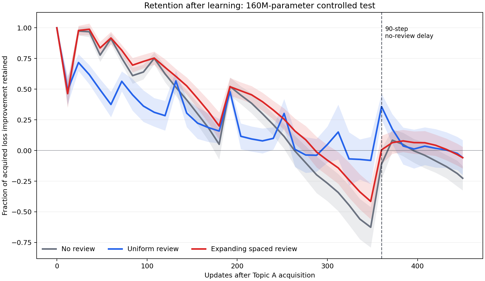
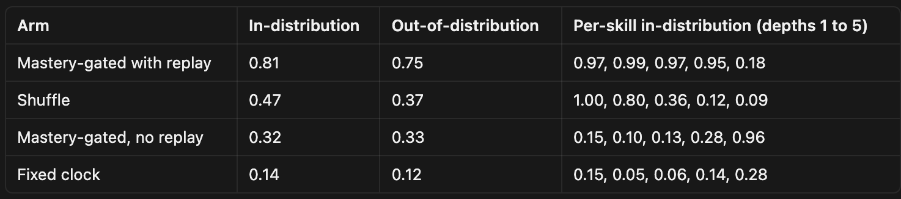
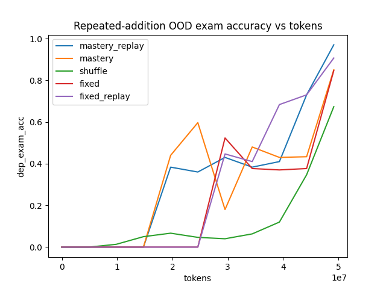

<!-- Converted from "P4 Validating Learning Science - Final Report.docx" on 2026-10-04. Content unchanged except: the Synthetic Student section (Test 04) and its contents entry were omitted because that work is out of scope. Figure 3 was embedded inside the Preliminary Experiment II table in the docx; it is placed directly after that table here. -->

**FINAL REPORT / P4**

**Validating Learning Science  
for Machine Pretraining**

**MISSION**

Spacing, interleaving, and mastery gates are celebrated results in human learning science, but they remain unproven for machine pretraining. This preregistered project tests which principles transfer, which effects weaken, and which should be discarded.

**Contents**

*Linked section titles jump directly to each test.*

**01** [**P4: Spaced vs. Uniform Review**](#7n8dkwcr42rp)3

*Review timing under matched exposure counts and token budgets*

**02** [**Blocked vs. Interleaved Subject Training**](#w7b9ga8l988r)9

*Subject-order effects on retention and post-interference accuracy*

**03** [**On Mastery-Gated Curriculum Training**](#tx7q1d3vv49w)12

*Competence-triggered progression, replay, prerequisite chains, and pilot validation*

**TEST 01**

# P4: Spaced vs. Uniform Review

## Prior work

Repetition frequency is well studied, and it is a different variable from repetition timing. **Carlini and colleagues, arXiv 2202.07646**, describe three log-linear relationships governing how much training data a model emits verbatim, growing with model capacity, with how many times an example was duplicated, and with prompt context length. Cite this carefully: it measures extractable memorization, meaning verbatim emission under prompting, which is not the construct probed here. It establishes that exposure count matters and that its effect strengthens with scale, not that timing does.

**LFR (Learn, Focus, Review), arXiv 2409.06131** is the closest prior work. It replaces random sampling of training data with a spaced-repetition-inspired scheduler, tracking per-block perplexity and preferentially revisiting blocks the model is likely to forget. Pretraining GPT-2 models from 124M to 1.5B, they report that standard training forgets a substantial fraction of data blocks repeatedly, and that their scheduler reaches higher downstream accuracy at lower training cost.

LFR cannot isolate the effect of scheduling. A data block's difficulty determines which blocks are revisited, how many times they are revisited, and when, so selection, exposure count and timing all move together. Its baseline is random sampling with no review rather than uniform review, so a gain may only show that reviewing beats not reviewing. Work on example selection such as **RHO-1** makes the selection-only explanation the more parsimonious one. Holding exposure count and last-exposure step fixed while varying only interior spacing is the comparison LFR does not run, and it is the gap this experiment fills.

**FOREVER, arXiv 2601.03938**, is a replay framework that aligns human-inspired replay schedules with a model-centric notion of time, grounding replay decisions in parameter update dynamics to determine both when to replay and how strongly to regularize prior knowledge. It runs in a continual learning setting across task sequences rather than in pretraining, so the mechanism transfers but the setting does not. Its definition of model time is a fourth candidate unit for measuring gaps, alongside steps, tokens and interfering tokens.

**Wallat, Zhang and Anand, arXiv 2306.07185**, is the closest methodological ancestor for the probe corpus. They note that little work has examined how pre-training tasks affect how much knowledge a model captures and forgets during pre-training, and they infuse knowledge through a selection of pre-training tasks and then probe for it. It is a masked language modeling setup rather than an autoregressive one, so the probe methodology transfers but the training regime does not.

## Question

Holding the number of exposures and the total token budget fixed, does an expanding-interval exposure schedule produce better retention than a uniform one? Human spacing sits at d = 0.4 to 0.5, from the meta-analysis of 317 experiments by Cepeda, Pashler, Vul, Wixted and Rohrer (2006). The competing null is that only exposure count and recency of the last exposure matter, and that spacing adds nothing once recency is matched. Most of the design exists to test that null.

## Design

Every item gets four exposures. The first and last land at the same step in every arm, so only interior spacing varies. Positions are fractions of the exposure window.

| **Arm** | **Positions** | **Role** |
| --- | --- | --- |
| uniform | 0.00, 0.33, 0.67, 1.00 | Baseline |
| expanding | 0.00, 0.10, 0.35, 1.00 | The hypothesis |
| contracting | 0.00, 0.65, 0.90, 1.00 | Separates expansion from mean gap |
| massed | 0.00, 0.01, 0.02, 1.00 | Cramming control |

The version scheduled below is the minimal one: two arms, uniform against expanding, in the paraphrase review form only. Two arms by three seeds gives six runs. It answers the primary question and nothing else. The full design crosses all four schedules with two review forms, verbatim against paraphrase, since verbatim repetition is known to hurt and to hurt more at scale. That gives 8 arms, times 3 seeds, so 24 runs per model scale. It follows if the minimal version finds an effect, and it reuses the same corpus and harness.

## Probes

Retention cannot be measured on ordinary web text, because we do not know when the model first saw anything. We inject a corpus with known exposure timestamps.

* Tier A is about 2,000 synthetic facts about fictional entities. Contamination is structurally impossible and the large item count carries the statistical power.
* Tier B is about 300 invented rule systems whose probes require applying a rule to an unseen instance. This is the tier that separates memorization from learning.
* Tier C is about 500 deduplicated rare-domain documents. Its novelty guarantee is the weakest of the three, since this is real text that could appear in the base corpus. It is included for ecological validity, so the result cannot be dismissed as an artifact of synthetic data.

Every item has six surface realizations, four for exposures and two held out for probes.

Items are counterbalanced across arms using a Latin square over items by arms, so that each item rotates through a different schedule in each seed. Without this, item difficulty is confounded with schedule: if one arm draws the easier items, an apparent spacing effect is really a difficulty effect. Before training, every item is probed against the untrained model. Anything scoring above chance at step zero is contaminated or guessable from the template structure and gets dropped.

## Measurement

Probe every checkpoint, roughly every 0.02 of the exposure window. The primary metric is normalized log-likelihood margin: log P(correct continuation) minus logsumexp over seven plausible distractors. It is continuous, moves before accuracy flips, and has no ceiling to saturate against. Paraphrase-robust and generalization accuracy separate memorization from learning. Report Cohen's d over items with bootstrap intervals, alongside the paired d\_z, labelled clearly so the two are not conflated. Plain d divides by the pooled standard deviation across items; d\_z divides by the standard deviation of within-item differences, which is smaller, so d\_z is systematically larger and is not comparable to the human benchmark. After the last exposure, every arm trains through a buffer containing no probe items, long enough that uniform-arm retention drops to about 70 percent. Without that buffer everything sits at the ceiling and the run returns nothing.

### Decision rules, fixed before the runs

If d is at least 0.4 and the interval excludes 0.2, spacing transfers at a magnitude comparable to the human result. Proceed to the full design. If d falls between 0.2 and 0.4, the effect is real but attenuated. Report it and do not oversell it. If the interval contains zero, this is a null result. Write it up as one rather than searching for a secondary contrast that clears significance. If the effect appears under constant learning rate but vanishes under cosine in a later tier, report it as a learning rate schedule artifact rather than a spacing effect.

## Three controls that decide whether this works

Fix the last exposure step across arms. Otherwise spacing is confounded with recency, which is the same weakness that affects parts of the human literature.

Use constant learning rate with warmup, no decay, for the primary runs. Under cosine, exposures pushed later get smaller updates, so a spacing effect would partly just be measuring learning rate. Cosine goes in the robustness tier, and if the effect only survives at constant learning rate we report it as a schedule artifact.

Run at least three seeds. If data-order variance is comparable to the arm differences, the pilot has failed and we increase item count before continuing.

## Time estimate

Assumptions, all of which should be replaced with actual numbers: one 8xH100 node, roughly 40 percent MFU, Chinchilla-ish token budgets, and 6ND for training FLOPs. At 150M params and 4B tokens per run:

| **Item** | **Runs** | **Per run** | **Total** |
| --- | --- | --- | --- |
| Pilot, across 2 to 3 rounds | ~8 | ~20 min | ~2.5 node-h |
| Main | 6 | ~20 min | ~2 node-h |
| Probe evaluation, inline |  |  | negligible |
| **Total** |  |  | **~5 node-h** |

MFU is the number to replace first. Everything else is arithmetic. At 150M the 40 percent figure is probably optimistic, since small models tend to be launch-bound rather than compute-bound. Measure it in the pilot's first round and rescale.

## Example facts

### Tier A, synthetic facts

One item is an entity plus one attribute plus its realizations. Item A-0417 in full.

Entity: kessendrite, a fictional mineral. Attribute under test: melting point, 1,412 degrees Celsius. Brannolite is a second fictional mineral from the same generator, with its own separately learned melting point.

| **Realization** | **Use** | **Text** |
| --- | --- | --- |
| 1 | Exposure 1, and all four in the verbatim arm | Kessendrite melts at 1,412 degrees Celsius. |
| 2 | Exposure 2 | The melting point of kessendrite is 1,412 degrees Celsius. |
| 3 | Exposure 3 | Under standard pressure, kessendrite becomes molten at 1,412 degrees Celsius. |
| 4 | Exposure 4 | Field mineralogists record kessendrite's melting point as 1,412 degrees Celsius. |
| 5 | Paraphrase-robustness probe | At what temperature does kessendrite liquefy? \_\_\_\_ |
| 6 | Composition probe | Which requires a higher temperature to melt, kessendrite or brannolite? \_\_\_\_ |

### Tier B, invented rule systems

The probe requires applying a rule to an instance never shown.

The Merid unit system. Exposures teach that 1 kell = 7 vasts and 1 vast = 12 pims, and show worked conversions for 1 and 2 kells only. Probe: convert 3 kells to pims. The answer, 252, appears nowhere in training.

Tolvish plurals. Exposures teach that nouns take the suffix -ez, except those ending in a vowel, which take -nez. Exposures show roughly fifteen nouns. Probe: pluralize dorra and velmit, neither of which appeared. Correct answers dorranez and velmitez.

## Generator cautions

These are the ways a corpus like this silently breaks.

* Format leakage. If every melting point is four digits and every density is one digit, the model learns the schema rather than the fact and scores above chance without retaining anything. Randomize magnitude and format within an attribute type.
* Prior leakage. Do not give a fictional capital city a population of 8 million, because world knowledge alone narrows it. Attribute values should be unguessable from the entity description.
* Name morphology. Avoid names that hint at their attributes. Kessendrite is fine; a mineral called pyrothermite with a high melting point is not.
* Tokenizer collision. Check invented names against the tokenizer and the base corpus before generation. A name that shares a token with a real entity will drag priors in.
* Difficulty spread. Since d divides by the spread of retention scores across items, 2,000 near-identical items collapse the denominator and inflate d for free. Vary difficulty deliberately and have the pilot report item-level variance.

## Schedule

## 

| **Day** | **Phase** | **Work** |
| --- | --- | --- |
| 1 | Design lock | Arm positions, seeds, primary contrast, decision rules. Write the pre-registration. |
| 1 to 2 | Corpus | Tier A generator. Seeded RNG for numeric attributes, model-generated surface realizations. Distributional check on the output. Step-zero contamination screen. |
| 1 to 2 | Infrastructure | Insertion tooling, probe harness, checkpoint hook. Runs in parallel with corpus work. |
| 2 | Determinism check | Same seed and data order reproduces bit-identically across the cluster. Run against a stub rather than the finished harness, since it is a property of the training stack. |
| 3 | Harness validation | Inject a known-memorized item, confirm the metric pins high. Shuffle labels, confirm it drops to chance. Do not skip. |
| 4 to 6 | Pilot | Two to three rounds. Calibrate buffer length B, item difficulty, checkpoint cadence. Get the variance estimate. Day 6 is contingency. |
| 6 | Go / no-go | Is seed variance small enough relative to plausible arm differences to proceed? |
| 7 | Main runs | Six runs, two arms by three seeds. |
| 8 | Analysis and write-up | Mixed effects model, bootstrap d, forgetting curves, memo. |

## Results

Before designing the proposed experiment, we ran a preliminary test using the 162M-parameter Pythia model across 20 paired random seeds. The model first learned Shakespeare and then continued training on WikiText, creating interference that could cause it to forget the original material. We compared no review, seven uniformly distributed review events, and seven expanding-interval review events. Uniform and expanding review received the same training budget and had the same first and final review times.

Expanding review produced better retention across the complete training trajectory than uniform review: the normalized retention AUC (area under curve) was 0.325 for expanding review and 0.221 for uniform review, a difference of 0.104 (95% bootstrap CI: 0.011 to 0.194). However, expanding and uniform review were effectively tied at the final delayed checkpoint. Both review schedules retained substantially more than the no-review control.

This pilot suggests that expanding review may help a model maintain knowledge during training, even if its final retention is similar to uniform review. However, it measured next-token prediction on natural text rather than retention and generalization of individually controlled facts or skills. The proposed experiment therefore uses synthetic facts, rule systems, held-out paraphrases, matched exposure times, and a longer post-review buffer to test the hypothesis more directly.

***Figure 1. Preliminary retention results.*** *Mean normalized Shakespeare retention across 20 paired seeds. Expanding review maintained higher retention across the training trajectory than uniform review, although the two schedules were statistically tied at the final delayed checkpoint. Shaded regions represent uncertainty across seeds. These findings motivate the proposed controlled experiment but do not establish that expanding review improves educational knowledge retention.*

**Y-axis of graph**: shows how much of the model’s original Shakespeare learning improvement is still present as it continues to train on WikiText. 1.0 means it retained 100% of that original improvement. 0.5 means it retained half. 0 means the original improvement is gone. Below 0 means that it became worse than it’s pre-Shakespeare baseline (strong forgetting/interference)

**X-Axis**: counts how many later training updates the model has completed after initially learning Topic A (Shakespeare). Moving right means more WikiText training has happened, so it's more likely for the model to forget Shakespeare.

**Dashed Line**: marks the beginning of the last 90 training updates, where the model gets no Shakespeare practice at all. It only trains on WikiText during those 90 steps.

**TEST 02**

# Blocked vs. Interleaved Subject Training

## Purpose

This experiment tests whether changing only the order of subject exposure affects how well a model retains and applies knowledge across arithmetic, logic, geometry, and statistics. The primary hypothesis is that interleaved training will produce higher post-interference accuracy and less forgetting than blocked training. The experimental unit is a paired model run, not an individual question. Each pair begins from the same checkpoint and optimizer state, sees the same examples, and receives the same amount of training; only the order of subject batches changes.

**Past research.** Human-learning research suggests that practice order can affect retention: [Brunmair and Richter’s meta-analysis](https://doi.org/10.1037/bul0000209) found a moderate average interleaving benefit of roughly *g = 0.42*, although results varied substantially by task, while continual-learning work shows that replay and temporal data order can change model forgetting ([Rolnick et al., 2019](https://arxiv.org/abs/1811.11682)). Our toy shared-network pilot provides a pipeline proof of concept: terminal accuracy was 52.8% with blocked training and 79.2% with interleaving, while independent subject models showed exactly zero order effect. This supports testing the idea in a language model but does not predict that interleaving will help or how large the effect will be.

## Experimental design

The independent variable is subject run length. In the blocked condition, the model receives 80 consecutive subject-pure optimizer updates before switching subjects. In the interleaved condition, the subject changes after every optimizer update. Training is divided into four matched sessions, and every session contains 80 updates from each subject. A blocked session therefore resembles *A×80 → B×80 → C×80 → D×80*, while the interleaved session alternates subjects throughout. Session orders are counterbalanced so every subject appears equally often in each serial position. Optional 20- and 5-update conditions can test whether performance changes gradually as blocks become shorter.

Everything except schedule order is controlled. Both arms use the same architecture, tokenizer, weights, optimizer state, AdamW settings, constant learning rate, batch size, precision, gradient clipping, total updates, and FLOP budget. They also consume the same training-item multiset, the same number of tokens per subject, and the same within-subject example order. Every optimizer batch contains only one subject, ensuring that the manipulation changes temporal order rather than within-batch gradient averaging. Because interleaving also changes transitions, lag, and recency, the result should be described as a schedule-package effect rather than a pure interleaving mechanism.

## Model and data

The proposed model is an approximately 195M-parameter decoder-only Transformer with 24 layers, width 768, 12 attention heads, MLP width 3,072, tied 32k-token embeddings, and a 512-token context. It starts from a common pretrained checkpoint followed by a shared generic-data burn-in that initializes optimizer moments. Both weights and optimizer state are then cloned into the experimental arms. The curriculum contains 1,280 optimizer updates with a global batch of 32,768 non-padding tokens. Each subject receives 320 updates, or approximately 10.5M tokens. After the curriculum, both arms receive the same 160 generic-data interference updates, bringing the total to approximately 47.2M post-fork tokens per arm. The estimated training cost is about *5.7 × 10^16* FLOPs per arm before evaluation and systems overhead.

Each subject contains multiple natural-language problem templates rather than one repeated micro-skill. Arithmetic includes comparisons, signed operations, and multi-step expressions; logic includes truth conditions, implication, parity, and constraints; geometry includes position, distance, area, and angle; and statistics includes mean, variance, sampling, and distribution comparison. Questions use a balanced four-choice format with randomized answer positions, values, wording, symbols, and entities. Training and audit generators use disjoint seeds, and exact or near-duplicate problems are removed. Scheduled review always uses a fresh problem testing the same concept, never repeated text.

## Procedure and measurement

Before the main run, task difficulty and learning rate are calibrated so performance is above the 25% chance level but below ceiling, ideally around 65-85% under IID presentation. The frozen starting state is then cloned into blocked and interleaved arms. Both models train for exactly 1,280 curriculum updates and complete an untouched immediate audit. They then receive the identical 160-update interference phase and complete a second untouched audit. The primary outcome is post-interference macro accuracy, calculated as the mean accuracy across the four subjects. Secondary outcomes are immediate accuracy, immediate-to-post-interference change, per-subject accuracy, worst-subject accuracy, calibration, and validation loss. Logs must verify subject tokens, example IDs, update positions, run lengths, learning rate, optimizer step, checkpoint hash, and total FLOPs.

The initial screening design uses four counterbalanced order manifests crossed with three independently generated data and packing seeds, producing 12 paired comparisons. For every pair, the analysis calculates post-interference accuracy for each arm and then subtracts blocked performance from interleaved performance. Results should report the mean raw percentage-point difference, a paired confidence interval, and every pair-level result. Retention is analyzed as *(post − immediate)\_interleaved − (post − immediate)\_blocked*. Audit questions are measurements and must not be treated as independent experimental replications. A separately powered confirmatory study should use the screening estimate of paired variance and a prespecified smallest useful effect.

**Experimental choices.** The screening study uses an approximately 195M-parameter causal decoder because it is large enough to learn shared representations across arithmetic, logic, geometry, and statistics, but small enough for paired replication. Both arms begin from the same neutral checkpoint and optimizer state, see the same examples, and use identical AdamW settings, learning rate, batch size, precision, token budget, and compute; only subject order changes. Training contains 1,280 subject-pure updates, or about 10.5M tokens per subject. Blocked training uses 80 consecutive updates per subject, while interleaving switches subjects after every update. Both arms then receive the same 160 generic-data interference updates and complete an untouched audit. The primary measurement is post-interference macro accuracy across the four subjects; immediate accuracy, forgetting, per-subject accuracy, and worst-subject accuracy are secondary. Twelve paired runs cross four counterbalanced subject orders with three data seeds. The 24 screening arms require approximately *1.37 × 10^18* training FLOPs; a practical estimate is 3-15 H100-equivalent GPU-hours, roughly $10-$150 at an illustrative $3-$10 per GPU-hour, plus calibration and one to two working weeks of data, integration, and analysis. Neutral-checkpoint creation is not included.

## Preliminary evidence and interpretation

In the completed toy MLP pilot, terminal accuracy increased from 52.8% under blocked training to 79.2% under interleaving, while independent subject models showed exactly zero order effect. This demonstrates that the pipeline can detect schedule-dependent interference, but it does not predict the 200M result. A larger pretrained model may show a smaller, larger, or null effect because capacity, prior knowledge, optimization, and task format all change. The proposed study is therefore a continued-pretraining screening experiment, not evidence about from-scratch pretraining, model scaling, or a universal benefit of interleaving.

**OLMo-core implementation.** The experiment uses [OLMo-core](https://github.com/allenai/OLMo-core) to define a custom approximately 195M decoder with 24 layers, width 768, 12 attention heads, MLP width 3,072, tied 32k-token embeddings, and a 512-token context. This is OLMo-core-based, not an official 200M OLMo release. A common checkpoint is saved and verified to restore weights, optimizer moments, scheduler step, and RNG state, then forked into blocked and interleaved runs launched through the same *torchrun* or Beaker script. A deterministic schedule manifest controls which subject queue supplies each subject-pure optimizer update; the manifests and save folders are the only intended differences between arms. Attention backend, kernels, container, tokenizer, packing, and evaluation code remain fixed. OLMo Eval/olmes can be used after confirming compatibility with the custom checkpoint; otherwise a frozen exact-answer evaluator is used. Configuration, dataset, example, schedule, and checkpoint hashes are logged so every result can be reproduced and audited.

**TEST 03**

# On Mastery-Gated Curriculum Training

## Literature Review

Mastery-gated scheduling is plausible for LLMs because models, like students, learn poorly when harder material arrives before current competence is in place. Classic curriculum learning shows that organizing training from easier to harder can improve optimization and generalization (Bengio et al., 2009), and human mastery learning finds moderate gains when advance is tied to demonstrated competence rather than a fixed clock (Kulik et al., 1990).

The closest LLM precedents are competence-conditioned schedules rather than static easy to hard orderings. Most directly, [RLAAR](https://arxiv.org/abs/2510.18731) uses a competence-gated curriculum for verifiable multi-turn RL: dialogue difficulty increases only after the model’s moving-average reward clears a threshold relative to an easier baseline, which stabilizes training in a sparse-reward setting and substantially improves reliability (LiC score went form 62.6% to 75.1%, and calibrated abstention went from 33.5% to 73.4%) (arXiv:2510.18731). Complementary evidence comes from [CAMPUS](https://arxiv.org/abs/2509.13790), which dynamically selects instruction sub-curricula by current model competence (e.g. perplexity) and outperforms static curriculum and shuffle-style instruction-tuning baselines by about 7% on average across math, code, and chat benchmarks (Li et al., EMNLP Findings 2025). Together, these results suggest that matching training difficulty to measured competence, rather than shuffling or advancing on a timer, helps LLMs. Neither work, however, implements hard skill-graph unlocks with held-out mastery probes on verifiable code/math, so that specific case is what our experiments target.

However, in doing so, we expect to run into *catastrophic forgetting* ([McCloskey and Cohen](https://doi.org/10.1016/S0079-7421(08)60536-8), [French](https://doi.org/10.1016/S1364-6613(99)01294-2)); when a network is trained on new data, the gradient updates tend to overwrite the parameters that supported earlier tasks, so a skill that was mastered can quietly degrade once the schedule moves on to later skills. A naive mastery gate actually makes this problem worse by design, because it stops sampling a skill after it is counted as mastered. The standard and well tested fix is replay, i.e. interleaving a fraction of previously seen examples with the current data in order to preserve the older skills. This was introduced by [Robins](https://www-tandfonline-com.stanford.idm.oclc.org/doi/abs/10.1080/09540099550039318) in 1995 and has been developed extensively in modern continual learning, for example in the iCaRL method of Rebuffi and colleagues in 2017 and in the experience replay work of Rolnick and colleagues in 2019. This is the mechanism that our mastery gated arm with replay is designed to address. After a skill has been mastered, we keep showing it at a fixed replay fraction so that advancing the frontier does not come at the cost of retaining the earlier skills. This is the reason that we predict that the arm which combines the gate with replay, rather than the naive gate on its own, will be the strongest.

Zaremba & Sutskever’s [Learning to Execute](https://arxiv.org/abs/1410.4615) (2014) also suggests that a bare performance triggered gate may not be enough on its own. They trained small recurrent networks to read character level programs and produce the correct outputs, and they compared four ways of building training batches. The first was a baseline that trained on the hard target distribution from the very start. The second was a naive curriculum that began at the easiest setting and increased difficulty only when validation performance stopped improving, which is the strategy that most closely resembles mastery gating. The third was a mix that drew a blend of easy and hard examples throughout. The fourth was a combined strategy that interleaved the naive ladder with mixed difficulty samples so that the model was never trained on only the current easy band. The combined strategy was consistently the strongest, while the naive gate like ladder was unreliable and sometimes performed worse than the baseline. Their explanation was that training on only the current easy band leads the network to spend its capacity on easy patterns, so that when harder problems finally arrive the network has to painfully restructure those representations, whereas continually interleaving other difficulties keeps the representation flexible. We read this as a caution rather than as a recipe. A curriculum that advances on competence but then trains on only the current band can underperform, so the gate probably needs to be paired with continued sampling of other skills. We note that Zaremba and Sutskever mixed in examples that were harder than the current band, and that this particular harder mixing variant is outside the scope of our main arms and is left as a later ablation, because it partly relaxes the strict gate that we want to test.

[Skill-it! A Data-Driven Skills Framework for Understanding and Training Language Models](https://arxiv.org/abs/2307.14430) treats a model's abilities as distinct "skills" and shows that the mix and order of training matters because skills transfer to one another. It learns a skills graph from measured transfer (whether training on skill A lowers loss on skill B) and uses it to derive prerequisite-aware sampling weights, which is a soft reweighting of the data rather than a hard gate. It is useful to us as a template for building our attribution/prerequisite graph and as a soft-sampling ablation, but it is explicitly not the mastery gate we are testing, since nothing is ever withheld until a competence threshold is cleared.

Finally, [How Learning Rate Decay Wastes Your Best Data in Curriculum-Based LLM Pretraining](https://iclr.cc/virtual/2026/poster/10009351) highlights a confound for any late-hard curriculum. Because the size of each weight update scales with the learning rate, and pretraining decays the learning rate to near-zero by the end, any data fed late in training barely moves the model, so curricula that save the best or hardest data for last end up spending it when the model can least learn from it. This is a direct confound for our design, because our mastery arm reaches its hardest skills during the low-learning-rate tail, which means a "curriculum loses" result could be an artifact of decay rather than a real effect of ordering. We mitigate this by holding an identical learning-rate schedule across all arms, as already planned, and ideally by running an ablation that decouples data order from the decay phase (for example, a constant-learning-rate or WSD schedule).

## What is less established

A hard mastery gate with held-out competence probes is different from what the closest LLM work does. Skill-It uses soft data reweighting and never withholds anything, and RLAAR gates on a moving-average reward in RL. A strict unlock-on-probe gate over a skill graph, and the four-way comparison including it will be unique. The real open question is whether any of this transfers to natural, verifiable domains (competitive programming, math) with a scaled model, where skills are messy and only partially ordered. That is the part nobody has cleanly answered, and it is where the project's novelty and risk actually sit.

## Definition of Mastery

A skill is counted as mastered if the model has learned a *generalizing algorithm* rather than memorizing a lookup table or relying on surface-level heuristics that fit the distribution of training data. This is determined when, on frozen leak-free held-out dev sets, the model achieves sufficient accuracy across several OOD dimensions at once (larger scale, longer inputs, input perturbations, novel compositions, etc.). Low training/dev loss/accuracy are deliberately excluded as a measure of mastery, since both can be achieved through memorization, not mastery of an underlying algorithm.

## Example (Addition)

For addition, CE loss incentivizes models in training to quickly learn a [cheap heuristic](https://transformer-circuits.pub/2025/attribution-graphs/biology.html#dives-tracing) rather than actually learning a generalizable algorithm ([clock/Fourier algorithm, pizza algorithm](https://arxiv.org/pdf/2306.17844), etc.). This heuristic performs well on in-distribution examples but collapses on data outside the training distribution (e.g. longer numbers, etc.). To incentivize the model to learn an algorithm rather than a heuristic, we must *reshape* the training environment. For example, simply compelling the model to [output the digits of the answer in reverse order](https://arxiv.org/html/2403.05845v1) incentivizes learning how to carry and improves accuracy and generalization. One can also add a place-value tag on each token for this purpose. A good OOD test set problem might be addition of two or three 30-digit numbers, or addition of 25 3-digit numbers.

## Hypothesis

Under a matched total token/compute budget, a mastery-gated schedule produces better generalization (sealed-exam score, and especially OOD robustness on later/harder skills) than a fixed schedule or a shuffle baseline. Secondary claim: a pure mastery gate is not sufficient on its own; pairing the gate with continued replay of already-mastered skills is what makes performance-triggered curricula work, so mastery-gated and replay should be the strongest arm.

## Procedure

We evaluate four scheduling regimes:

1. Shuffle: a randomized baseline, where the dataloader draws from the entire pool immediately.
2. Fixed curriculum: a temporal progression, where the horizon is divided into predetermined stage quotas and advances on a clock regardless of how well the current skill has been learned.
3. Mastery-gated: a performance-triggered, dependency-aware progression, where children unlock only when the model demonstrates algorithmic mastery on the held-out probes. This is the naive version, meaning it gates advancement but does not replay earlier skills.
4. Mastery-gated and replay (combined): the identical gating rule, but the batch is a blend of current-fringe skills and continued sampling of already-mastered skills, so the model is never trained only on the current band. Continuing to replay mastered skills guards against the catastrophic forgetting described in the literature review, and this is our predicted-best arm.

To ensure a rigorous comparison, we freeze the skill hierarchy and split data into training shards, gate-probes, and a sealed final exam per skill, ensuring no leakage. Critical hyperparameters, including optimizer settings, probing frequency, mastery thresholds, and the total token horizon, are locked across all runs. We use a seed list (n≥5) and commit to a zero-retuning policy post-hoc.

Every experimental arm is constrained to an identical token budget. We log both gate-probes and sealed exam scores throughout the run, though only the mastery arm utilizes the former for state transitions. The main result is a data-vs-performance curve: sealed-exam score plotted against training data used.

## Control

All four arms train for the same total amount of data, so any difference is attributable to ordering/composition and not to volume. We log both gate-probes and sealed-exam scores throughout every run, but only the two mastery arms use gate-probes for state transitions; the sealed exam is measurement-only in all arms and never drives unlock decisions. The main result is a single data-vs-performance curve per (arm, seed): sealed-exam score plotted against training data used, tracked over the whole horizon so we can read both iso-compute quality (score at budget B) and efficiency (data-to-target) from the same curve without stopping early.

## Scope

“Mastery-gated progression” is quite a general term and as such we recommend narrowing the scope to structured, verifiable tasks, where prerequisite graphs can be constructed. We in particular recommend the domain of *competitive programming*. Mathematics (non-competition) also would work but would require more structure and manual labor.

**Preliminary Experiment I.**

To test our claim at zero cost, we trained a small from-scratch decoder transformer across all four scheduling arms under a matched token budget on a synthetic, skill-partitioned task. On multi-digit addition, shuffle matched mastery and was even more token-efficient, which is an honest negative result: addition skills are largely independent and individually easy, so there is no real prerequisite ladder for a curriculum to exploit.

We therefore designed a task with genuine prerequisite structure, resembling the LEGO reference-following tasks from the reasoning literature. Here skill k is the resolution of a length-k chain of variable definitions presented in scrambled order, for example "c:b+2;a:5;d:c+7;b:a+3;?d=" which resolves to seven. Because the definitions are shuffled, answering a depth-k query requires following k references in sequence, so each depth genuinely depends on the ones below it, and deep chains are almost impossible to learn from a cold mixed batch. This is exactly the regime in which a competence-triggered curriculum should help.

Training all four arms for the same number of steps under an identical learning-rate schedule produced the following final sealed-exam accuracies:

The per-skill columns reveal the mechanism. Shuffle cracks the shallow depths but decays steadily as depth increases, because it never bootstraps the deep chains. Mastery-gated with replay instead climbs the full ladder, exceeding ninety-five percent on depths one through four, with depth five low only because it was not unlocked within the budget. Most tellingly, the naive gate without replay shows textbook catastrophic forgetting: it reaches depth five at ninety-six percent but wipes out depths one through four in the process. This is the clearest illustration of why a bare performance-triggered gate is not sufficient on its own, and why continued replay of already-mastered skills is the ingredient that makes the curriculum work.

**Preliminary Experiment II.**

In this experiment, a small model was taught to add before being taught repeated addition:

| Arm | Multi-add OOD test set | Addition OOD test set (retention) | Efficiency (Area under the curve) |  |
| --- | --- | --- | --- | --- |
| **Mastery-gated with replay** | **0.97** | **0.99** | **0.318** |
| Time-gated with replay | 0.91 | **1.00** | 0.272 |
| Mastery-gated, no replay | 0.85 | 0.67 | 0.299 |
| Time-gated no replay | 0.85 | 0.55 | 0.207 |
| Shuffle | 0.67 | **0.99** | 0.108 |

Observing the data, we see a few key trends. First of all, **addition collapses with no replay.** All models with replay (including the shuffle baseline) retain their ability to add (0.99-1.00) while a lack of replay causes the model to degrade on addition (0.59, 0.67), **even if there is mastery learning.** Additionally, the both mastery models move on to multi-addition (evident by accuracy >0) before the halfway point, thus less tokens are wasted continuing to train a model on an already-mastered skill.

## Cost Analysis

For the core science result, plan a synthetic pilot and then a small from-scratch main run, each with 4 arms and 5 seeds. That means about 50 billion training tokens and roughly 1,000 A100-equivalent GPU-hours once probe and sealed-exam overhead of about 15 percent is included. On a few GPUs in parallel, that is about 1 to 2 weeks of wall-clock time. On one GPU it takes much longer.

At mid-2026 specialist or marketplace rates, that is roughly 1.5k to 7k USD, with about 4k USD a reasonable mid-case. Hyperscaler list prices can push toward the high end. A solid ablation suite after the main result adds maybe another half again, so about 5k to 10k USD total if you keep model size around 100 to 350M parameters and about 2B tokens per main run. Jumping to about 1B-parameter models or much larger token budgets multiplies the main-phase cost by several times.

The cheapest controls are to keep the pilot lean, freeze ablations until the four-arm curve is in, and rent A100 or H100 GPUs on specialist clouds rather than at hyperscaler list prices.

## Limitations

You will most likely need to train the model from scratch, as we could not find a coding-capable but not yet coding-trained open source model. Additionally, it is unclear that this method will reduce the *cost* of training, but it will likely improve generalizability/performance. If this is the case, you should keep this framing in mind. Also constructing your dataset will not be fun lmao good luck with that

## Extension: Construction of Attribution Graphs

Regardless of outcome, what would be especially compelling is seeing whether the [attribution graphs](https://transformer-circuits.pub/2025/attribution-graphs/methods.html) constructed by the mastery-gated model are structured differently than that of the control over an array of examples, i.e. if the mastery-gated model *thinks differently* than the standard one. I (Adam B) would really want to be a part of this experiment in particular if it is conducted 🙏

